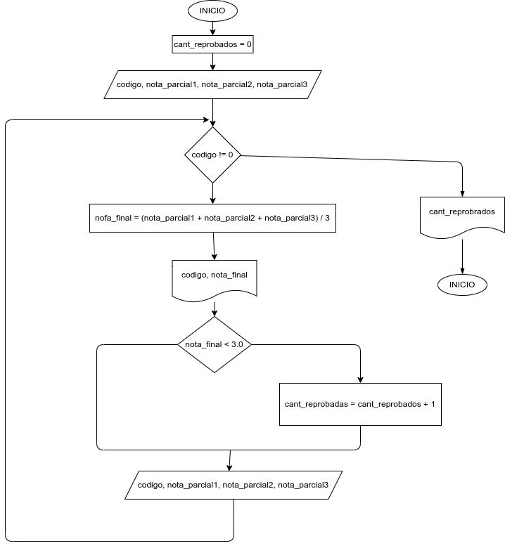

# registro_centinela

# REGISTRO CENTINELA

Se dice que un ejercicio utiliza **Registro Centinela**, cuando el último dato de entrada tiene caractaristicas especiales, es decir, se diferencia de todos los demás, de modo tal que puede ser utilizado para determinar cuándo termina el proceso repetitivo que involucra la entrada de datos.

## Caso No. 1

Hacer el diagrama de flujo y el programa en Python que por cada estudiante lea el código y las notas de los tres parciales de una materia, y que calcule e imprima el código y la nota final de cada estudiante.  No sabemos cuántos estudiantes son, pero despues de la información del último, se introduce cero en el campo correspondiente al código, de modo tal que sirva como **Centinela** para indicar cuando terminan los datos de entrada.  También se debe informar al final cuántos estudiantes perdieron la materia.

# Diseño

